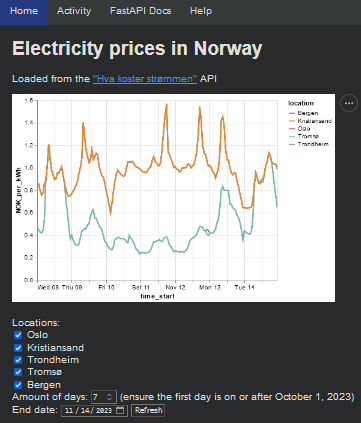

# IN3110 strømpris
[](https://github.com/psf/black)



Fetches and visualizes electricity prices in regions of Norway from the [Hva koster strømmen api](https://www.hvakosterstrommen.no/strompris-api) and visualizes them in a web application with interactive configuration like regions, date, number of days. Contains a activity price page to calculate when you should plan to do electricity-heavy activity in your region.

Also contains the submodule `klima` which plots the global mean temperatures by month for each year from the [National Centers for Environmental Information](https://www.ncei.noaa.gov) datasets.

Created for assignment 5 of the UiO course in3110.

## Installation
Clone the repo and navigate to the assignment 5 directory

```shell
git clone https://github.uio.no/IN3110/IN3110-lassepl.git
```
```shell
cd IN3110-lassepl/assignment5
```

Install the module and its dependencies
```shell
python3 -m pip install .
```

## Create the webpage
Run the application script
```shell
python3 app.py
```

Uvicorn will then give you a link in the terminal which you can go to in your browser, which by default is `http://127.0.0.1:5000/`.

## Running the submodule `Klima`
Navigate to the submodule 
```shell
cd klima

```
Create the webpage
```shell
python3 app.py
```

Uvicorn will then give you a link in the terminal which you can go to in your browser, which by default is `http://127.0.0.1:4000/`.